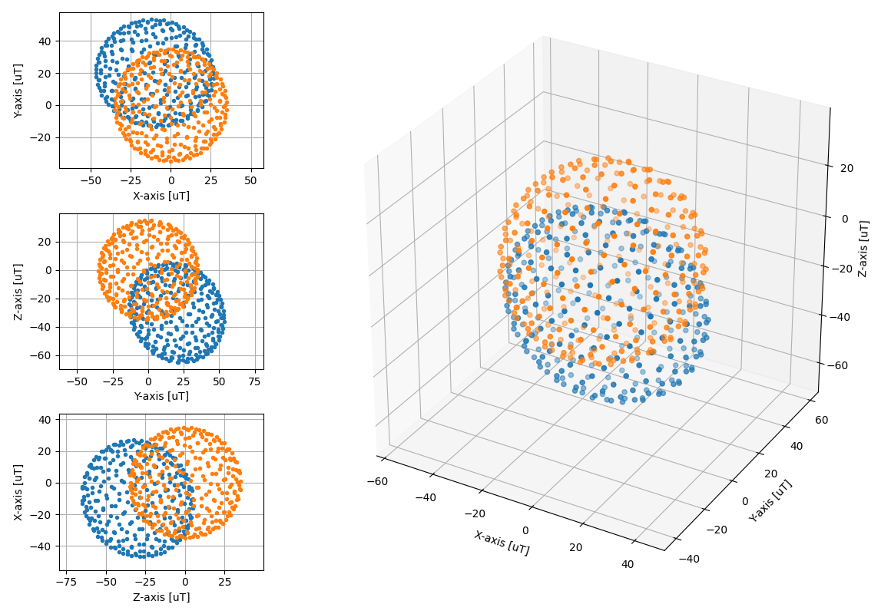

# fittinglib

``` bash
virtualenv env
source ./env/bin/activate
pip install -r requirements.txt
```

## Example

``` bash
>> python3 .\test_ellipsoid_fit.py

    Ground Truth
    -- sens --------------------------- bias ------- radi
     0.95000,  0.02000,  0.04000,     -10.000,      35.000,
     0.02000,  1.05000,  0.06000,      20.000,
     0.04000,  0.06000,  1.00000,     -30.000,
    
    Ellipsoid Fitting
    -- sens --------------------------- bias ------- radi
     0.95252,  0.02005,  0.04011,     -10.000,      35.093,
     0.02005,  1.05278,  0.06016,      20.000,
     0.04011,  0.06016,  1.00265,     -30.000,
```


